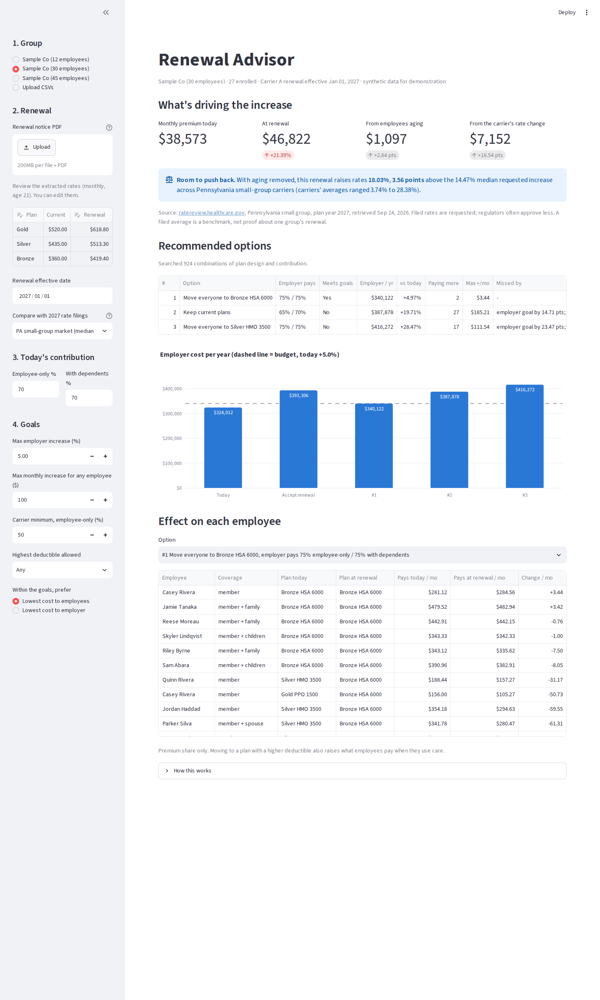

# Renewal Advisor (POC)

A small-group health insurance renewal advisor for brokers. It breaks a renewal
increase into **carrier rate change vs. the group getting older**, benchmarks
the rate part against the carrier's **public rate filing**, and (next) recommends
the plan + contribution mix that meets the employer's budget.

Data models mirror [Clasp's API](https://docs.withclasp.com/) field names
(members, dependents, plans, `premium_type`, `coverage_type`, `benefit_split`
contribution strategies, 21-year-old base rate for age-banded tables).

All people, plans and rates are synthetic and illustrative.

## Quick start

```bash
python -m venv .venv && source .venv/bin/activate
pip install -e ".[dev,app]"
pytest                      # 41 tests
python scripts/demo.py      # terminal demo: sample groups of 12, 30, 45
streamlit run app.py        # the web app (opens in your browser)
```



To regenerate the sample renewal notices: `python scripts/make_renewal_pdfs.py`.

## Layout

```
src/renewal_advisor/
  models.py         Pydantic models (Clasp-shaped)
  age_curve.py      Federal default ACA age curve + age calculation
  rating.py         Per-person age rating, 3-oldest-children-under-21 rule
  renewal.py        Exact rate-vs-aging breakdown + benchmark vs filings
  contributions.py  Employer/employee split (benefit_split strategy)
  scenarios.py      Scenario engine: price options, compare vs. today
  recommender.py    Goal-constrained search over plan designs x contributions
  census.py         Synthetic census generator + CSV read/write
  filings.py        Public rate filings + push-back benchmark
  ingest.py         Renewal PDF parsing, census CSV upload, Claude fallback
app.py              Streamlit front-end
scripts/demo.py     Terminal demo
scripts/make_renewal_pdfs.py  Sample renewal notice PDFs
tests/              Hand-computed cases + invariants
docs/               Data sources and next steps
```

## Status

| Build-plan day | Status |
| --- | --- |
| 1. Data models on Clasp field names | Done |
| 1. Confirm filing data for one state | Done: all 16 PA small-group 2027 filings |
| 2. Census generator + age-rated premium engine | Done, tested |
| 3. Scenario engine + rate-vs-aging breakdown | Done, tested |
| 4. Benchmark against filings | Done, tested |
| 5. Goal-constrained recommender | Done, tested |
| 6. Streamlit UI + PDF extraction | Done, tested |
| 7. Polish, verify, Loom | Next |
