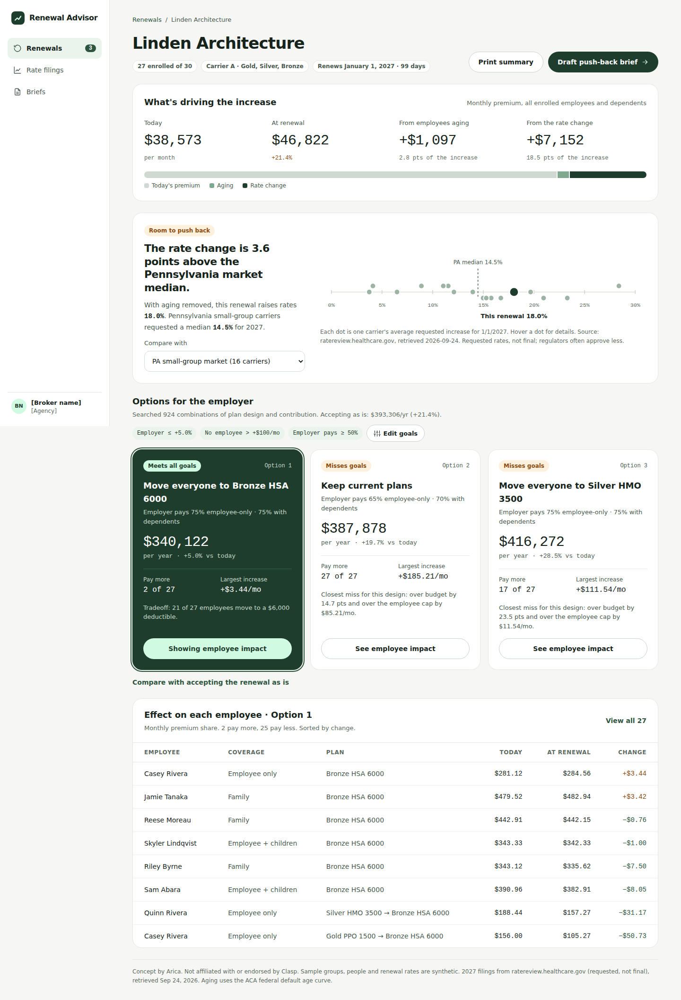

# Renewal Advisor

A small-group health insurance renewal advisor for benefits brokers. For each
renewing group it:

1. **Breaks the increase down** into the carrier's rate change vs. employees
   aging into older ACA age bands (the two add up exactly).
2. **Benchmarks the rate change** against real 2027 Pennsylvania small-group
   rate filings (market median, or a specific carrier's filing and product range).
3. **Recommends options** (plan design x employer contribution) that meet the
   employer's budget and a cap on any employee's increase.
4. **Drafts a push-back brief** to the carrier, as a PDF or email.

Data models mirror [Clasp's API](https://docs.withclasp.com/) field names.
Independent concept, not affiliated with Clasp. All people, plans and renewal
rates are synthetic; filings are real (see `data/rate_filings/`).



## Run it locally

Two terminals, both in this folder:

```bash
# 1. Python API (http://127.0.0.1:8000, docs at /api/docs)
python -m venv .venv && source .venv/bin/activate
pip install -e ".[dev,web]"
python -m pytest
npm run api

# 2. Web app (http://localhost:3000)
npm install
npm run dev
```

## Deploy (Vercel, two projects from this repo)

Vercel runs one framework per project, so the API and the web app are two
projects pointing at the same GitHub repo.

1. **API:** Add New → Project → import the repo. Framework Preset: **FastAPI**.
   Name it e.g. `renewal-advisory-api`. Vercel finds the app through
   `[tool.vercel] entrypoint` in `pyproject.toml`. Check
   `https://<api>.vercel.app/api/health` returns `{"ok":true}`.
2. **Web:** the Next.js project. Settings → Environment Variables → add
   `API_URL` = `https://<api>.vercel.app`, then redeploy. `next.config.ts`
   proxies `/api/*` to it, so the browser never talks to the API directly.

## Layout

```text
app/                     Next.js pages: inbox, group analysis, brief, filings
components/, lib/        UI components, API client and formatting
api/index.py             FastAPI endpoints
src/renewal_advisor/
  service.py             What the API returns (plain dicts)
  models.py              Pydantic models (Clasp-shaped)
  age_curve.py           Federal default ACA age curve
  rating.py              Per-person age rating, 3-oldest-children-under-21 rule
  renewal.py             Exact rate-vs-aging breakdown
  filings.py             Rate filings + push-back benchmark
  scenarios.py           Price options, compare vs. today
  recommender.py         Goal-constrained search over designs x contributions
  census.py, ingest.py   Synthetic census, renewal PDF parsing
streamlit_app.py         Earlier Streamlit prototype (python -m streamlit run streamlit_app.py)
tests/                   Hand-computed cases, invariants, API contract
data/                    Sample census + renewal PDFs, 2027 PA filings
```
